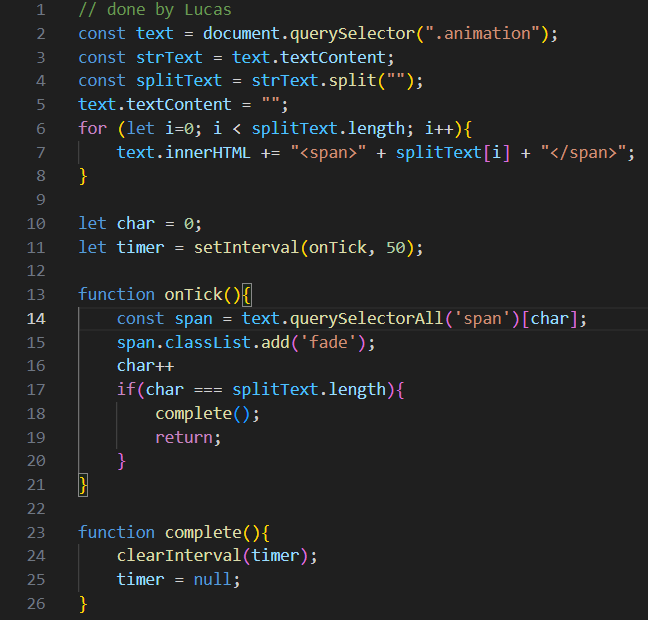

# Travel-site

 "const text = document.querySelector(".animation");"
 1. The first line of code selects an html variable and assigns it to a text.
 
 
"const strText = text.textContent;"
2. the second line retrieves the text content and assigns it to the variable strText.
 
 
"const splitText = strText.split("");"
3. the third line splits all of the text into individual characters and assigns them to the "variable splitText"
 
 
"text.textContent = "";"
4. this line clears the original text since they have now doubled.
 
 
"for (let i=0; i < splitText.length; i++){
    text.innerHTML += "" + splitText[i] + "";"
}
5. This line wraps each individual character into a  tag.
 
  
    "let char = 0;"
  6. this line keeps track of the current character being animated
 
  
    "let timer = setInterval(onTick, 50);"
  7. This line is a timer that every 50ms activates the onTick function. This creates the animation effect.
 
  
    "function onTick(){
    const span = text.querySelectorAll('span')[char];
    span.classList.add('fade');
    char++
    if(char === splitText.length){
        complete();
        return;"
    }
}
  8. This block adds the fade animation using css and it moves the effect to the next character on every tick.
  
  
    "function complete(){
    clearInterval(timer);
    timer = null;"
  9. This last line makes sure that when the animation is done it stops the timer which stops the animation.
  

